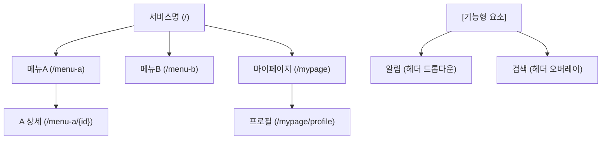
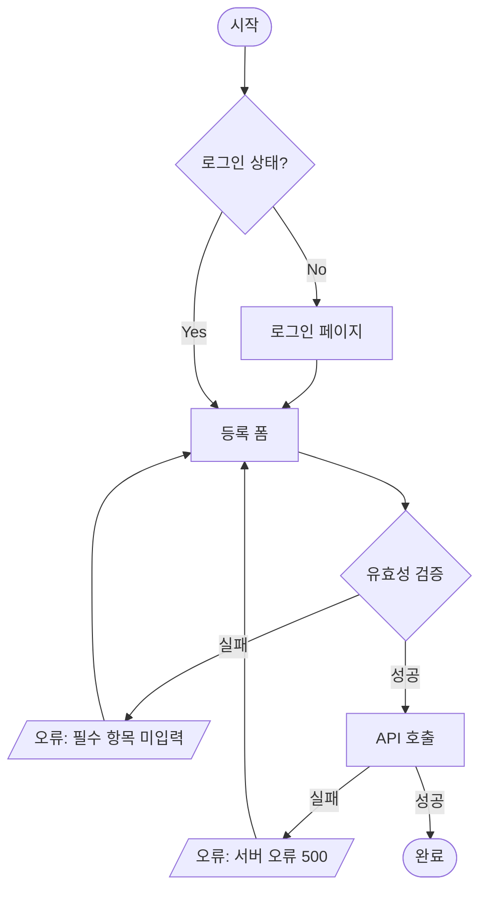

# User Flow Skill — IA + 유저 플로우 설계

## Input Gate

필수 입력 없으면 HARD-GATE 중단:
1. product-context.md (`product/{project}/`)
2. PRD (`product/{project}/PRD.md`) + **`approved: true`** 필수
   ```
   ❌ [HARD-GATE] PRD가 미승인(approved: false) 상태입니다.
   PRD 검토 후 approved: true로 변경하세요.
   ```

## Output Gate

`product/{project}/ux/ia-userflow.md` 존재 시:
- 파일 로드 → 버전·날짜 한 줄 표시
- AUQ: "기존 버전 수정 | 다음 단계(wireframe)로 진행 | 아카이브 후 새로 작성"
- 선택에 따라 분기. 새로 작성 선택 시에만 아래 Phase 진행.

## Phase 1 — IA (정보구조 설계)

### 페이지형 vs 기능형 요소 구분

| 구분 | 정의 | IA 처리 |
|---|---|---|
| 페이지형 | 독립 URL 보유 (`/home`, `/mypage`) | GNB 1depth 가능 |
| 기능형 | URL 없이 오버레이/드롭다운으로 동작 | **1depth 절대 불가** — 별도 블록 |

기능형 요소 예: 알림(Notification), 검색(Search), 모달, 토스트

### Depth 체계

| Depth | 정의 | URL 예시 |
|---|---|---|
| 1depth | GNB 메뉴 진입점. 독립 URL 필수 | `/home`, `/service`, `/mypage` |
| 2depth | 1depth 하위 서브 페이지 | `/service/{id}`, `/mypage/profile` |
| 3depth | 모달·탭·바텀시트 (URL 없거나 쿼리 파라미터) | `?tab=review`, `#modal-create` |

### 사이트맵 Mermaid 형식



**범례 필수 포함:**
- 1depth — GNB 진입점
- 2depth — 서브 페이지
- 3depth — 모달·탭
- 기능형 요소 — 별도 블록 (점선 박스)

## Phase 2 — 유저 플로우 설계

### 핵심 플로우 선정 기준 (3~7개)
- 사용자 빈도 최고 플로우
- 비즈니스 핵심 전환점 포함
- 에러·예외가 복잡한 플로우

### Mermaid flowchart 형식



**각 플로우 필수 포함 요소:**
- 분기 조건: 로그인 상태, 권한 레벨, 데이터 유무
- 에러케이스: 404, 403, 500, 유효성 실패
- 빈 상태(Empty State): 데이터 없음·첫 방문·검색 결과 없음

### 와이어프레임 명세 형식 (화면별)

```
### [화면명] (화면 ID: PC200001)

**목적**: 유저가 이 화면에서 달성하는 것

**레이아웃**
- 상단: 헤더 / GNB
- 중단: 주요 콘텐츠
- 하단: CTA 버튼 / 탭바

**구성 요소**
| 요소 | 타입 | 상태 | 액션 |
|---|---|---|---|
| 저장 버튼 | Button(Primary) | 활성/비활성 | 탭 → 저장 |

**빈 상태**: 데이터 없을 때
**에러 상태**: 실패 시
**로딩 상태**: 처리 중
```

## 산출물

`product/{project}/ux/ia-userflow.md` 저장 후 `product/{project}/manifest.md` 업데이트:
- ia-userflow 행: `✅ 완료`, 현재 버전·날짜 기입

`product/{project}/ux/ia-userflow.md` 내용:

```markdown
# {서비스명} IA + User Flow
버전: v1.0 | 날짜: YYYY.MM.DD

## 1. IA
### 1-1. GNB 메뉴 구조
### 1-2. 기능형 요소
### 1-3. 사이트맵 다이어그램
### 1-4. 범례

## 2. User Flow
### 2-1. 핵심 플로우 목록 (선정 이유 포함)
### 2-2. {플로우명} Flow

## Archive (구버전 보존)
```

## Constraints

- 알림·검색 1depth 금지 — 기능형 요소는 반드시 별도 블록
- 모든 1depth URL 경로 표기 필수
- 에러케이스·빈 상태 누락 시 미완성으로 표시
- IA와 User Flow 혼재 금지 — 섹션 분리
- 구버전 덮어쓰기 금지 — Archive 섹션으로 이동

## Anti-Triggers

- 와이어프레임 생성 → `wireframe` 스킬
- PRD·기능명세서 작성 → `prd-template`, `functional-spec` 스킬
- Figma 파일 생성 → `/hi-fi 스킬`
